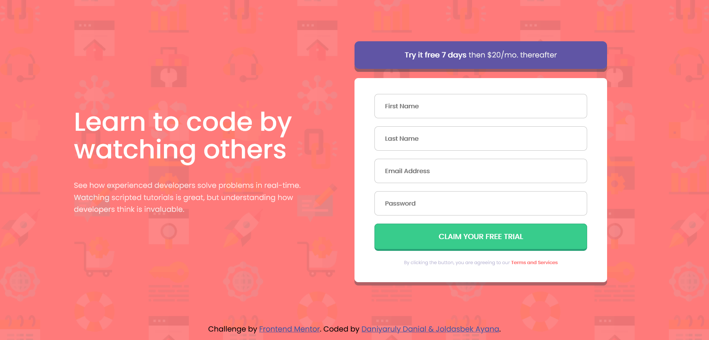

# Frontend Mentor - Intro component with sign up form 

## Table of contents

- [Overview](#overview)
  - [The challenge](#the-challenge)
  - [Screenshot](#screenshot)
  - [Links](#links)
  - [Process](#process)
  - [Built with](#built-with)
  - [What we learned](#what-we-learned)
  - [Continued development](#continued-development)
  - [Useful resources](#useful-resources)
- [Authors](#authors)
- [Acknowledgments](#acknowledgments)


## Overview
Intro component with sign-up form challenge hub. 
Сhallenge is to build out this introductory component and get it looking as close to the design as possible with using CCS and JS.

### The challenge

Users should be able to:

- View the optimal layout for the site depending on their device's screen size
- See hover states for all interactive elements on the page
- Receive an error message when the `form` is submitted if:
  - Any `input` field is empty. The message for this error should say *"[Field Name] cannot be empty"*
  - The email address is not formatted correctly (i.e. a correct email address should have this structure: `name@host.tld`). The message for this error should say *"Looks like this is not an email"*

### Screenshot




### Links

- Solution URL: [https://github.com/ZZZAyana/signupp.git] [https://github.com/TurboDanik/sign-up-form-practice1.git]
- Live Site URL: [https://zzzayana.github.io/signupp/] [https://turbodanik.github.io/sign-up-form-practice1/]

## Process

First of all we created HTML with semantics and added sign-up form. Then externally linked CSS and JS files to it. In CSS file we tried to add responsive and user-friendly design. And in JS we wrote throw if-else conditions validation for sign-up form.

### Built with

- Semantic HTML5 markup
- CSS custom properties
- Flexbox
- JS validation


### What we learned


```html
          <input type="text" id="fname" name="fname" placeholder="First Name" class="">
          <span class="" id="s-fname"></span>
        </div>
```
```css
input[type=submit]:hover {
  opacity: 0.8;
}
```
```js
form.addEventListener('submit', e=> {
}
```

### Continued development

Use this section to outline areas that you want to continue focusing on in future projects. These could be concepts you're still not completely comfortable with or techniques you found useful that you want to refine and perfect.

**Note: Delete this note and the content within this section and replace with your own plans for continued development.**

### Useful resources

- (https://www.w3schools.com/howto/howto_css_signup_form.asp) - This site helped me create a responsive sign up form using CSS.


## Authors

- Website - [Danial, Ayana](https://www.your-site.com)
- Frontend Mentor - [@ZZZAyana](https://www.frontendmentor.io/profile/ZZZAyana)
- Frontend Mentor - [@TurboDanik](https://www.frontendmentor.io/profile/TurboDanik)


## Acknowledgments

This is where you can give a hat tip to anyone who helped you out on this project. Perhaps you worked in a team or got some inspiration from someone else's solution. This is the perfect place to give them some credit.

**Note: Delete this note and edit this section's content as necessary. If you completed this challenge by yourself, feel free to delete this section entirely.**
